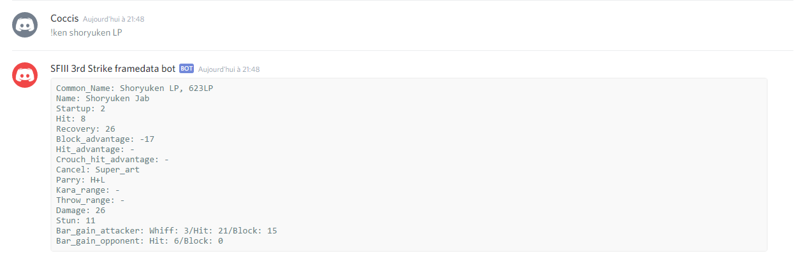

# Framedata for Versus Fighting games (Golang)

A simple framework to run a discord bot to display framedata for a specific character and a specific move.
Examples can be found for the following games:
* Street Fighter III: 3rd Strike - Fight for the Future => https://github.com/fmicaelli/thirdstrikedatabot

## How to use it?
1. Install the project:

`go get github.com/coccis77/framedata`

2. Create a new project with a `main` package.

3. Create a folder named `json` in the root of this project, and put the characters framedata in json files.
**There must be one file per character.**

4. In the main function, you have to call the function `RunBot(botToken string, g data.GetMove)` of the runbot.go file.

`botToken`, as its name said, is the unique discord token of the bot.
You can find it out on the discord official website, in the developer part.

`g data.GetMove` is a type defined in the data.go file:
`type GetMove func(characterData []byte, moveName string) (s string, err error)`

This function take the file in []byte, the move as a string, and return the string formatted for the discord bot.
**The bot will display the exact string returned by this function!**

You have to defined this function in your project.
You should create a struct that matches the json structure,
deserialize the file into that struct, check if the move exists
and return the formatted string if so, or an error if not.
It's up to you to know if a move exists, depending of how
you made the structure of the json and which field you want to check.

For example, in the **Street Fighter III: 3rd Strike** project,
we check if the moveName matches the official name or a common name.

## How do you run it?
In the main function, if you have run the RunBot function correctly,
your bot must have been online in the discord channel you invited it.
The bot will read all messages waiting for one matching a character and a move.

## What is the format the bot will be waiting for?
The format is the following:

`!characterName moveName`

The characterName must match the json file of your project (which must be the name of your character).

The moveName is the string which will be pass on the function type `GetMove`, and it's up to you to make it match with your structure.

If a character and a move match, the bot will display the data, like this:

